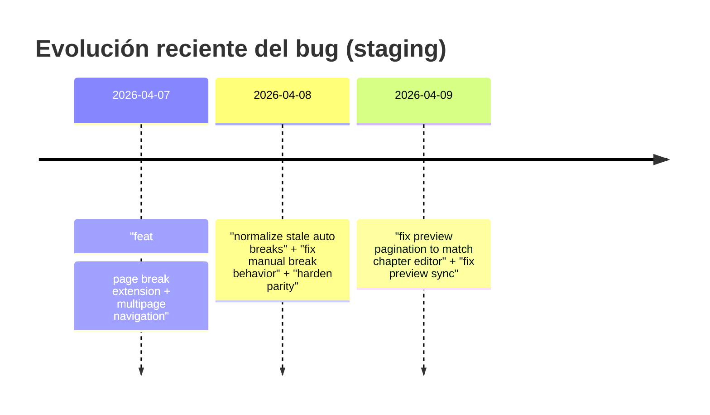

# Diagnóstico del desajuste entre el editor de capítulos y el preview en anclora-talent (rama staging)

## Resumen ejecutivo

En la rama **staging** del repositorio, el editor de capítulos y el preview comparten *parte* del pipeline de paginación (misma familia de utilidades: `buildPaginationConfig`, `paginateContent`, `reconcileOverflowBreaks`), pero **no comparten el mismo “source of truth” operativo** para determinar *qué* se considera una “página” y *cómo* se mapea una página concreta entre ambas vistas. citeturn46view0turn30view2turn34view2

Los síntomas que encajan con “el contenido de la página en el preview no coincide con las páginas del editor” suelen aparecer por una combinación de:

- **Desalineación de numeración y mapeo**: el editor navega páginas **por capítulo** (`P.{currentPage+1}`), mientras el preview construye páginas **globales** (incluye **portada como página 1** y luego numera secuencialmente a través de todos los capítulos). Esto hace que una comparación “página 2 vs página 2” tienda a ser incorrecta incluso si el HTML total es el mismo. citeturn24view0turn34view2turn44view2
- **Diferencia de criterio para el total de páginas** en el editor: el `useChapterEditor` mezcla un conteo “estimado” (en realidad paginación por `paginateContent`) con un conteo “medido” reportado por el propio editor (`onPageCountChange`), y después **clampa al mínimo**. Si el conteo medido infraestima, el editor y el preview divergen en *cuántas páginas existen y dónde cae el corte*. citeturn30view2turn24view0
- **Tratamiento de saltos (manual/auto) y normalización del HTML**: el editor normaliza/armoniza markup de separadores y `<hr data-page-break="…">` en su flujo de carga/cambio; el preview repagina de nuevo tras convertir bloques a HTML. Si `reconcileOverflowBreaks` no es completamente idempotente en todos los casos (p.ej., por variaciones de markup), el resultado puede no coincidir a nivel de página. citeturn35view0turn34view2turn49view0

Además, el historial de commits del propio archivo `useChapterEditor.ts` en **staging** muestra que este tema ha estado en plena corrección durante los días **7–9 de abril de 2026**, incluyendo mensajes explícitos de “fix preview pagination to match chapter editor” y arreglos relacionados con *auto breaks*, *manual breaks* y sincronización editor/preview. Esto confirma que el bug es real y recurrente, no un falso positivo. citeturn49view0

No hay issues ni PRs abiertos en el repositorio (0/0), así que la trazabilidad del bug está prácticamente toda en commits y en contratos/MD internos. citeturn49view0

Lo que recomiendo como arreglo “conservador y de alta probabilidad” (sin rediseñar el editor) es:

- Hacer que el **editor use el mismo total de páginas que el preview** como referencia (o, como mínimo, que no clample al mínimo con un conteo medido que puede infraestimar).
- Hacer visible en el preview el **mapeo capítulo→página-local**, para que el usuario compare “capítulo X / página local Y” en ambos lados, no “página global N”.
- Unificar una **normalización previa de markup de saltos** para ambos pipelines (editor y preview), de forma que repaginar sea idempotente.

En el resto del informe detallo el mapa de módulos, los hallazgos a nivel de archivo y parches concretos.

## Arquitectura relevante y flujo de datos

La app tiene estructura típica de **Next.js App Router** (por la presencia de `src/app/(app)/...` y rutas `page.tsx`) y separa claramente:

- Ruta de **editor**: `src/app/(app)/projects/[projectId]/editor/page.tsx` (carga `project` y renderiza `ProjectWorkspace`). citeturn11view0
- Ruta de **preview**: `src/app/(app)/projects/[projectId]/preview/page.tsx` (carga `project` y renderiza `PreviewCanvas`). citeturn13view0

El “capítulo editor” real está encapsulado en un modal fullscreen: `ChapterEditorModal → ChapterEditorFullscreen → useChapterEditor → AdvancedRichTextEditor`. citeturn19view0turn24view0turn35view0

El preview se construye con `PreviewModal` y un builder de páginas `buildPreviewPages` que convierte bloques a HTML, repagina y produce un array de páginas con numeración global. citeturn44view0turn34view2

```mermaid
flowchart TD
  A[Route: /projects/{id}/editor] --> B[ProjectWorkspace]
  B --> C[ChapterEditorModal]
  C --> D[ChapterEditorFullscreen]
  D --> E[useChapterEditor]
  E --> F[AdvancedRichTextEditor]

  B --> G[PreviewCanvas]
  G --> H[PreviewModal]
  H --> I[buildPaginationConfig]
  H --> J[buildPreviewPages]
  J --> K[chapterBlocksToHtml]
  J --> L[reconcileOverflowBreaks]
  J --> M[paginateContent]

  E --> N[saveChapterContentAction]
  N --> O[projectRepository.saveDocument]
  O --> P[(DB o memoria)]
```

### Estado, serialización y persistencia

**Estado en editor**:
- `useChapterEditor` mantiene `localChapters`, `currentIndex`, `htmlContent`, `currentPage`, `measuredTotalPages`, etc. citeturn30view1turn30view2
- El contenido que se edita es **HTML** (`htmlContent`). citeturn24view0turn30view1
- Guardado: crea `FormData` con `htmlContent` y llama a `saveChapterContentAction`, luego hace `router.refresh()`. citeturn30view2turn30view1

**Serialización “bloques → HTML”**:
- `chapterBlocksToHtml` escapa texto plano y envuelve en `<p>`, pero si el contenido empieza por `<`, lo trata como HTML ya formateado. citeturn31view0

**Persistencia (server action)**:
- `saveChapterContentAction` reemplaza el capítulo por **un único bloque** con el HTML completo, y deja el resto de bloques como vacío para “preservar IDs”. citeturn48view2
- Tras guardar, invalida cachés de editor/preview con `revalidatePath`. citeturn48view2

**Capa de repositorio**:
- `projectRepository.getProjectById` lee de DB si existe; si no, usa “memory store”. Esto implica que en despliegues sin DB, la consistencia entre requests puede depender del ciclo de vida del proceso. citeturn38view3

## Hallazgos y causas raíz

### Comparativa editor vs preview

| Eje | Editor de capítulos (modal) | Preview (modal/ruta) | Impacto probable |
|---|---|---|---|
| Unidad de paginación mostrada | Página **local del capítulo** (`P.{currentPage+1}`) citeturn24view0 | Página **global del libro** (portada=1, contenido=2+, secuencial) citeturn34view2 | Comparaciones “página N vs página N” fallan por offset y por capítulos previos |
| Modo de visualización por defecto | Single-page (navega página local) citeturn24view0 | `viewMode` arranca en `'spread'` (doble página) citeturn44view2 | El usuario puede “ver dos páginas a la vez”, cambiando la percepción de cortes |
| Fuente del total de páginas | Mezcla de `paginateContent` (estimado) + `measuredTotalPages`, con **clamp al mínimo** citeturn30view2turn24view0 | Paginación directa de `buildPreviewPages` usando `paginateContent` sobre HTML reconciliado citeturn34view2turn44view0 | Si el medido infraestima, el editor y preview dejan de coincidir en cortes |
| Config de formato | `desktop → laptop` + preferencias (font/margins) citeturn35view0turn22view2 | `preferredFormat = desktop ? laptop : device`, luego `buildPaginationConfig` citeturn44view2turn46view0 | En principio alineado; divergencias sólo si el CSS real difiere |
| Serialización | Edita HTML y lo guarda como HTML en un bloque citeturn30view1turn48view2 | Convierte bloques a HTML y repagina citeturn34view2turn31view0 | OK si el HTML es limpio; sensible a markup de saltos y normalización |

### Causa raíz principal: mapeo de “página” distinto (local vs global)

En el editor, el indicador es explícitamente local:

```tsx
<span className="text-xs ...">
  P.{editor.currentPage + 1}
</span>
```

citeturn24view0

En el preview, el builder construye un array de páginas donde la portada es `pageNumber: 1` y la numeración del contenido empieza en 2 y continúa globalmente:

```ts
let globalPageNumber = 2; // Content starts immediately after cover
...
pages.push({ type: 'content', content: pageHtml, pageNumber: globalPageNumber, ... })
```

citeturn34view2

Esto por sí solo explica un “no coincide” si el usuario compara “P.2 (editor)” con “página 2 (preview)”, porque “página 2 (preview)” corresponde típicamente a “P.1 del capítulo 1” (tras la portada). Además, en spread view el salto se percibe diferente. citeturn44view2turn34view2

**Diagnóstico**: aunque el contenido total sea igual, el **mapeo visual** no está alineado; el sistema no ofrece un “capítulo X / página local Y” en preview.

### Causa raíz funcional: el editor puede infraestimar páginas al clamplear contra `measuredTotalPages`

En `useChapterEditor` el total de páginas que controla la navegación se calcula así:

```ts
const totalPages = Math.max(
  1,
  Math.min(measuredTotalPages ?? estimatedTotalPages, estimatedTotalPages),
);
```

citeturn30view2

Eso equivale a: “si hay un conteo medido, **usa el más pequeño** entre el medido y el estimado”. Si el conteo medido reporta menos páginas (p. ej., porque mide sólo páginas visibles, porque hay fuentes aún sin cargar, porque hay rounding de alturas, etc.), el editor permitirá navegar menos páginas y por tanto su “Página 2” puede no equivaler a la segmentación que el preview construye con `paginateContent`. citeturn24view0turn30view2

El preview, en cambio, paginará siempre con el builder (y su filtrado de páginas renderizables):

```ts
const reconciledChapterHtml = reconcileOverflowBreaks(chapter.html, config);
const chapterPageHtmls = paginateContent(reconciledChapterHtml, config)
  .filter((page) => hasRenderablePageContent(page.html))
  .map((page) => page.html);
```

citeturn34view2

**Resultado típico**: el preview “mueve” cortes de página respecto al editor o muestra páginas adicionales que el editor no considera dentro de `totalPages`.

### Causa raíz contribuyente: normalización de separadores/saltos no centralizada

El editor tiene una normalización explícita del HTML que (entre otras cosas) convierte variantes de `<hr>` en representaciones canónicas y elimina separadores importados:

- En `useChapterEditor`, `normalizeHtmlContent` elimina `<hr>` sin `data-page-break`, convierte `data-page-break="true"` a `"manual"`, etc. citeturn35view0
- El historial de commits muestra múltiples arreglos alrededor de “stale auto breaks”, “manual page break pagination behavior”, “hide imported decorative separators”, etc. citeturn49view0

El preview builder repagina siempre tras convertir a HTML, pero no está claro (desde los fragmentos revisados) que aplique exactamente la **misma** capa de normalización que el editor aplica en carga/cambio (sí aplica `reconcileOverflowBreaks`, pero la normalización previa de markup es un vector clásico de no-idempotencia si hay múltiples variantes). citeturn34view2turn35view0

### Línea temporal relevante (commits en staging)

El historial del archivo `useChapterEditor.ts` en staging indica una secuencia de cambios muy reciente (7–9 abril 2026) centrada justo en paginación/saltos/paridad editor-preview, incluyendo:

- 2026-04-09: “fix preview pagination to match chapter editor” y “fix preview sync and chapter save navigation” citeturn49view0  
- 2026-04-08: “normalize stale auto page breaks on chapter load”, “fix manual page break pagination behavior”, “harden multipage pagination parity”, etc. citeturn49view0  
- 2026-04-07: “feat: Implement page break extension and multi-page chapter navigation”, “refactor: Integrate images directly into chapter content as embedded HTML”, etc. citeturn49view0  



citeturn49view0

## Parches propuestos y pasos de aplicación

> Objetivo: que “Página X” en editor y preview **sea comparable** y que el corte sea consistente.

### Preparación

Comandos recomendados:

```bash
git fetch origin
git checkout staging
git pull --ff-only origin staging

git checkout -b fix/preview-editor-pagination-parity
```

### Parche A (recomendado): hacer que el editor use el mismo total de páginas que el preview

**Problema que ataca**: el clamp al mínimo puede hacer que el editor navegue “menos páginas” que el preview (o que sus cortes se perciban distintos). citeturn30view2turn34view2

**Cambio**: tomar `estimatedTotalPages` (que ya deriva de `paginateContent` cuando hay DOMParser) como fuente de verdad para `totalPages` en la navegación del editor.

Diff sugerido (conceptual) en `src/components/projects/advanced-chapter-editor/useChapterEditor.ts`:

```diff
-  const totalPages = Math.max(
-   1,
-   Math.min(measuredTotalPages ?? estimatedTotalPages, estimatedTotalPages),
-  );
+  // Source of truth: paginateContent(...) like PreviewBuilder does.
+  // Keep measuredTotalPages only as telemetry/UX hint (it can undercount in edge cases).
+  const totalPages = Math.max(1, estimatedTotalPages);
```

citeturn30view2

**Por qué esto mejora la paridad**: el preview builder paginará con `paginateContent(...)` tras reconciliar; al usar la misma referencia para `totalPages`, reduces la divergencia y evitas que el editor “colapse” páginas por un conteo medido que no sea estable. citeturn34view2turn30view2

### Parche B: exponer en el preview el “número de página local del capítulo”

**Problema que ataca**: hoy el preview numera de forma global (portada=1 y luego global), mientras el editor muestra páginas locales del capítulo. Esto genera una falsa sensación de “no coincide”, aunque el contenido sea el mismo. citeturn24view0turn34view2

**Cambio**: derivar para cada `PreviewPage` de tipo `content` un contador local por `chapterId` y mostrarlo en UI (p. ej., “Capítulo: X · P. Y (capítulo) · P. Z (global)”).

Ya existen `chapterTitle` y `chapterId` en las páginas de tipo content en `buildPreviewPages`. citeturn34view2

Pseudocódigo en `src/components/projects/PreviewModal.tsx` (zona donde ya se calcula `pages` con `buildPreviewPages`):

```diff
  const pages = useMemo(() => {
    return buildPreviewPages(project, paginationConfig);
  }, [paginationConfig, project]);

+ // Precompute per-chapter local page numbers to match ChapterEditor navigation.
+ const pagesWithLocalChapterIndex = useMemo(() => {
+   const counters = new Map<string, number>();
+   return pages.map((p) => {
+     if (p.type !== 'content' || !p.chapterId) return { ...p, chapterPageLocal: null };
+     const next = (counters.get(p.chapterId) ?? 0) + 1;
+     counters.set(p.chapterId, next);
+     return { ...p, chapterPageLocal: next };
+   });
+ }, [pages]);
```

Luego, en el render de la “barra inferior/superior” donde se muestra la página (no incluido en los fragmentos, pero el archivo ya gestiona estado de navegación y UI completa), mostrar:

- `p.pageNumber` (global) y
- `p.chapterPageLocal` (local del capítulo).

Base del archivo: la configuración y `pages` ya están en `PreviewModal` y la selección de formato está definida (`mobile/tablet/laptop`). citeturn44view0turn44view2turn44view4

### Parche C: normalización compartida de markup de saltos antes de paginar (editor + preview)

**Problema que ataca**: divergencias sutiles cuando el HTML contiene separadores importados o variantes de `<hr>` que se interpretan distinto en momentos distintos. El editor ya hace normalización por regex/DOMParser. citeturn35view0turn49view0

**Cambio recomendado**:
- Extraer `normalizeHtmlContent` (o al menos su “normalizeBreakMarkup”) a un módulo compartido, por ejemplo: `src/lib/preview/html-normalize.ts`.
- Usarlo tanto en `useChapterEditor` como en `buildPreviewPages` antes de `reconcileOverflowBreaks(...)`.

Justificación: reduce el riesgo de no-idempotencia y alinea el “input canónico” del paginador. El historial de commits refuerza que justo aquí hay fragilidad. citeturn49view0turn35view0turn34view2

Diff conceptual en `src/lib/preview/preview-builder.ts`:

```diff
- const reconciledChapterHtml = reconcileOverflowBreaks(chapter.html, config);
+ const normalizedChapterHtml = normalizeDocumentHtml(chapter.html);
+ const reconciledChapterHtml = reconcileOverflowBreaks(normalizedChapterHtml, config);
```

citeturn34view2turn35view0

### Parche D (opcional, para robustez de sincronización): propagar “onSave” hacia ProjectWorkspace

`ChapterEditorFullscreen` invoca `onSave?.()` tras guardar. citeturn22view2turn24view0  
En `ProjectWorkspace` se instancia `ChapterEditorModal` sin pasar `onSave`. citeturn18view0

Aunque `useChapterEditor` ya hace `router.refresh()`, un `onSave` en el workspace puede servir para:
- refrescar estados derivados,
- forzar recomputaciones de métricas,
- o, si el problema observado es “preview dentro del stepper no se actualiza”, asegurar que el `project` prop se rehidrate correctamente.

Implementación: pasar `onSave={() => router.refresh()}` desde `ProjectWorkspace` al modal.

## Pruebas y pasos de reproducción/verificación

### Reproducción manual recomendada (antes del fix)

1. Abrir `/projects/{id}/editor`. citeturn11view0  
2. Abrir un capítulo en el editor fullscreen (modal). citeturn19view0turn24view0  
3. Insertar suficiente texto para forzar múltiples páginas y (si existe la opción) insertar un salto manual (`<hr data-page-break="manual">` suele ser el markup canónico). citeturn35view0turn46view0  
4. Navegar del editor a `P.2` y anotar la primera frase visible. citeturn24view0  
5. Abrir preview (en step 6 dentro del workspace o ruta `/projects/{id}/preview`) y navegar a la página global correspondiente. citeturn13view0turn42view0turn44view2  
6. Comparar: sin UI de mapeo, es fácil equivocarse (“P.2 capítulo” ≠ “página 2 global”). citeturn34view2turn24view0

### Verificación manual (después de aplicar parches A+B)

- Con el parche **B**, el preview debería mostrar explícitamente:
  - Página global (`pageNumber`) y
  - Página local del capítulo (`chapterPageLocal`).
  
Así, la comparación correcta sería “Capítulo X · P.local=2” en ambos lados. citeturn34view2turn24view0

- Con el parche **A**, el número total de páginas disponible en el editor debería coincidir con el resultado del paginador y, por tanto, con el preview, reduciendo drift de cortes.

### Tests automatizados sugeridos

El repositorio ya contiene tests en `src/lib/preview/*.test.ts` y `src/lib/projects/*.test.ts`, así que el patrón de testing existe. citeturn32view0turn26view0

Añadiría:

- Un test de **idempotencia**: `normalizeDocumentHtml` + `reconcileOverflowBreaks` aplicado dos veces → output estable.
- Un test de **paridad**: para un HTML de muestra y un `PaginationConfig` fijo (`buildPaginationConfig('laptop', ...)`), verificar que:
  - `paginateContent(reconcileOverflowBreaks(html))` devuelve el mismo número de páginas que el editor considera navegables (tras parche A). citeturn46view0turn34view2turn30view2

## Riesgos, impacto y rollback

### Riesgos e impacto

- **Cambio en el número de páginas “oficial” del editor** (parche A): si actualmente el editor usa `measuredTotalPages` para algún comportamiento de UX (p.ej., limitar navegación para evitar “páginas vacías”), al ignorarlo podrías exponer páginas adicionales. Esto suele ser deseable para paridad, pero puede afectar expectativas de UI. citeturn30view2turn24view0
- **Normalización más agresiva del HTML** (parche C): si hay contenido que dependía de `<hr>` “libres” o separadores importados, podrían desaparecer o reinterpretarse como saltos. Esto está alineado con la intención del código de normalización (borrar separadores decorativos y mantener saltos canónicos), pero debe verificarse con documentos importados reales. citeturn35view0turn49view0
- **Persistencia en memoria**: si el entorno no tiene base de datos y depende del “memory store”, pueden aparecer inconsistencias entre requests (especialmente en entornos serverless). Esto no es estrictamente el bug de paginación, pero puede manifestarse como “preview no coincide” tras navegar/recargar. citeturn38view3turn48view2

### Rollback

Si el cambio provoca regresiones:

1. Revert local:
   ```bash
   git revert <SHA_DEL_COMMIT>
   ```
2. O rollback global:
   ```bash
   git checkout staging
   git reset --hard origin/staging
   ```
3. Para cambios de normalización (parche C), una alternativa menos arriesgada es feature-flag:
   - aplicar normalización sólo en preview primero,
   - o sólo cuando detectes patrones concretos (p.ej., `<hr data-page-break="true">`). citeturn35view0turn34view2

En caso de dudas sobre cuál commit introdujo/mitigó el problema, el historial indica commits explícitos del **9 de abril de 2026** que apuntan directamente al fix de paridad y sincronización; usar esos SHAs como referencia de rollback/compare es el camino más rápido. citeturn49view0