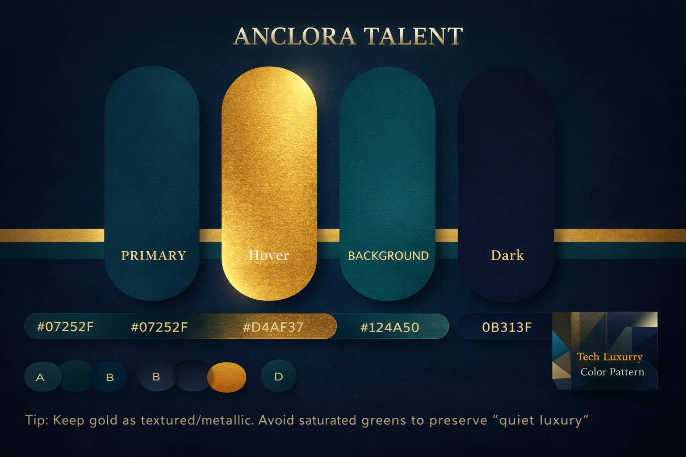

<!-- markdownlint-disable MD001 MD013 MD033 MD041 MD060 -->

<div align="center">



# Anclora Talent

### Repositorio interno del ecosistema Anclora para operaciones de familia premium

[Español](./README.md) · **English**

<br />


</div>

---

> [!IMPORTANT]
> Internal Anclora ecosystem repository. Do not publish operational details, credentials,
> real data or sensitive logic outside approved channels.

## At a glance

| Area | Definition |
| --- | --- |
| Purpose | Repositorio interno del ecosistema Anclora para operaciones de familia premium |
| Family | `premium` |
| Visibility | `private` |
| Role | Internal working repository |

## Conceptual workflow

```text
Internal context
      ↓
Controlled configuration and data
      ↓
Product logic
      ↓
Technical review
      ↓
Delivery or operational support
```

## Local start

```bash
npm install
npm run dev
```

## Technology

| Area | Detail |
| --- | --- |
| Next.js | Detected in repository |
| React | Detected in repository |
| TypeScript | Detected in repository |
| Tailwind CSS | Detected in repository |
| Drizzle ORM | Detected in repository |
| Own auth | Credentials (bcrypt) + opaque sessions persisted in Neon; no external providers |
| Zod | Detected in repository |
| Vitest | Detected in repository |

## Documentation

- [Documentacion](./docs)

## Governance

- Canonical product: `anclora-talent`
- Vault: `/mnt/c/Users/antonio.ballesterosa/Desktop/Proyectos/Boveda-Anclora`
- Contracts: `contracts/` and `docs/governance/`
- Brand asset: `present`

---

<div align="center">

### Anclora Group · Internal use

</div>
