

Anclora Talent

Manual de usuario

Crea, edita y prepara tus proyectos editoriales para publicar.

  
Versión 1.0

  
11 septiembre 2026

Guía práctica de la aplicación actual. Las capturas usan datos de demostración y no contienen cuentas ni contenido personal.

## Índice

Esta guía sigue el recorrido natural de un proyecto: entrar, crear una base, editar el manuscrito, revisar el resultado y exportarlo.

- **Primeros pasos**: capítulos 1 a 4.
- **Trabajo editorial**: capítulos 5 a 8.
- **Portada, preview y exportación**: capítulos 9 a 11.
- **Preferencias y ayuda**: capítulos 12 a 16.

| Capítulo | Para qué sirve |
| --- | --- |
| 1. Empieza aquí | Entender el producto y elegir tu recorrido |
| 2. Cuenta, acceso y recuperación | Entrar, registrarte y recuperar la contraseña |
| 3. Dashboard y proyectos | Localizar, abrir y organizar proyectos |
| 4. Crear un proyecto | Empezar desde cero o importar un manuscrito |
| 5. Workspace editorial | Reconocer las áreas de trabajo |
| 6. Importar y preparar el manuscrito | Analizar un documento y revisar su estructura |
| 7. Capítulos, edición y formato | Escribir, ordenar y dar formato al contenido |
| 8. Composición, metadatos y guardado | Ajustar la publicación sin perder el manuscrito |
| 9. Portada y contraportada | Diseñar las superficies de publicación |
| 10. Preview y revisión final | Leer el proyecto antes de descargarlo |
| 11. Exportar | Elegir HTML, Word o PDF y revisar el archivo |
| 12. Trabajar en móvil y tablet | Entender qué cambia en pantallas estrechas |
| 13. Idioma, tema y preferencias | Cambiar ES/EN, oscuro/claro y vista de edición |
| 14. Si algo no funciona | Recuperarse de los problemas más habituales |
| 15. Preguntas frecuentes | Respuestas rápidas |
| 16. Glosario | Significado de los términos de la aplicación |

## 1. Empieza aquí

Anclora Talent es un espacio de trabajo editorial. Te permite reunir un manuscrito, convertirlo en un proyecto organizado, editar sus capítulos, preparar portada y contraportada, revisar una preview y descargar distintos formatos.

La aplicación trabaja con dos ideas importantes:

- **Tu manuscrito es el contenido principal.** La preview, la composición y los archivos descargados se generan a partir de él.
- **Cada proyecto conserva su identidad.** El título, los capítulos, el orden, los metadatos y las superficies de publicación pertenecen al mismo proyecto.

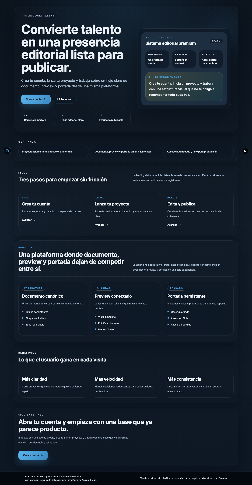

### Qué puedes hacer

- Crear un proyecto vacío o partir de un documento.
- Importar documentos compatibles y revisar la estructura detectada.
- Escribir y editar capítulos.
- Usar títulos, párrafos, listas, citas, enlaces, imágenes y saltos de página.
- Ajustar composición, tamaño de texto, márgenes y dispositivo de referencia.
- Diseñar portada y contraportada.
- Consultar una preview paginada y una vista completa.
- Descargar HTML, Word y PDF desde el área de preview.
- Guardar versiones y consultar el estado del documento.
- Cambiar idioma entre español e inglés.
- Elegir tema oscuro o claro.

### Elige tu recorrido

| Si estás en esta situación | Empieza por |
| --- | --- |
| Es tu primera visita | Capítulos 1 y 2 |
| Ya tienes un manuscrito | Capítulos 4 y 6 |
| Quieres escribir desde cero | Capítulos 4, 5 y 7 |
| Quieres preparar una portada | Capítulo 9 |
| Necesitas un archivo final | Capítulos 10 y 11 |
| Trabajas desde un teléfono | Capítulo 12 |
| Algo no responde como esperabas | Capítulo 14 |

Las capturas del manual usan proyectos y nombres sintéticos. Los textos de tu cuenta pueden ser diferentes.

## 2. Cuenta, acceso y recuperación

### Crear una cuenta

**Cuándo usarlo:** cuando aún no tienes un espacio de trabajo.

1. Abre Anclora Talent y pulsa **Crear cuenta**.
2. Escribe tu **Nombre completo**.
3. Escribe tu **Email**.
4. Crea una contraseña de al menos ocho caracteres, con al menos una letra y un número.
5. Pulsa **Crear cuenta**.
6. Si aparece un aviso de validación, corrige el campo indicado y vuelve a intentarlo.

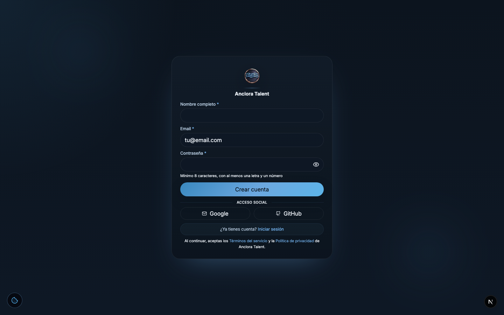

El email debe tener un formato válido. Si ya existe una cuenta con ese email, la aplicación no crea otra cuenta: vuelve al acceso y utiliza la contraseña correspondiente.

### Iniciar sesión

1. Pulsa **Iniciar sesión**.
2. Escribe tu email.
3. Escribe tu contraseña.
4. Pulsa **Iniciar sesión**.

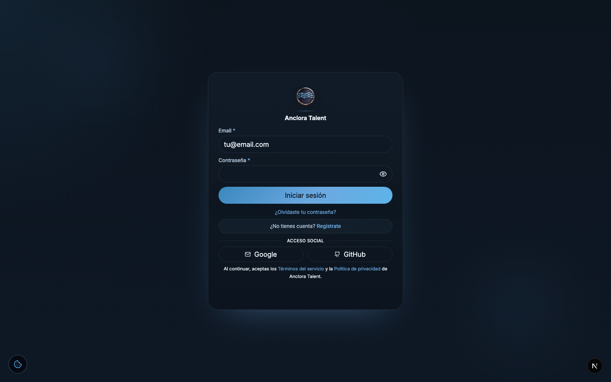

El icono del campo de contraseña permite mostrarla u ocultarla durante la comprobación. Si las credenciales no son válidas, se muestra un mensaje general de acceso incorrecto. Esto protege la información de las cuentas: el mensaje no revela si un email concreto está registrado.

### Acceso social

En una configuración con Google o GitHub habilitados, sus botones abren el recorrido del proveedor correspondiente. Si el botón aparece desactivado con el texto **Próximamente**, utiliza email y contraseña. No intentes introducir tu contraseña de Google o GitHub en el formulario de Anclora Talent.

### Recuperar la contraseña

1. En la pantalla de acceso, pulsa **¿Olvidaste tu contraseña?**
2. Escribe el email de tu cuenta.
3. Pulsa **Enviar enlace de recuperación**.
4. Abre el enlace recibido y escribe una contraseña nueva.
5. Vuelve a iniciar sesión.

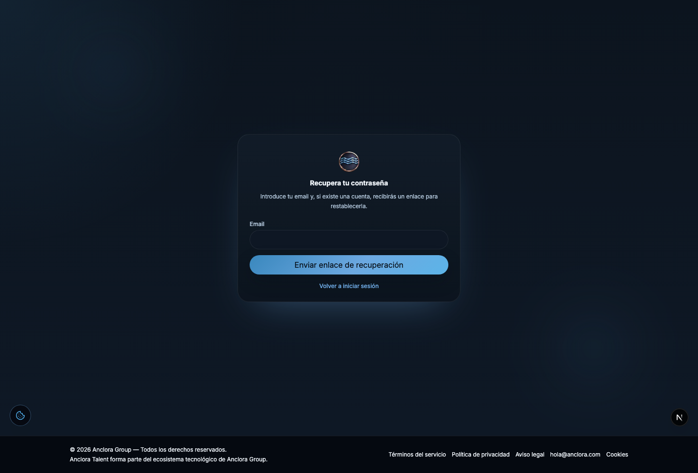

La pantalla confirma la solicitud sin revelar si el email existe. El enlace de recuperación es temporal y de un solo uso. Si no recibes ningún mensaje, revisa spam y confirma que el email está escrito correctamente. Si la instalación no tiene el servicio de correo operativo, verás un aviso de indisponibilidad y deberás contactar con la persona responsable del entorno.

## 3. Dashboard y proyectos

Después de iniciar sesión llegas al dashboard. La navegación principal reúne **Dashboard**, **Mis proyectos** y la creación de un proyecto. En la cabecera puedes cambiar idioma, tema y cuenta.

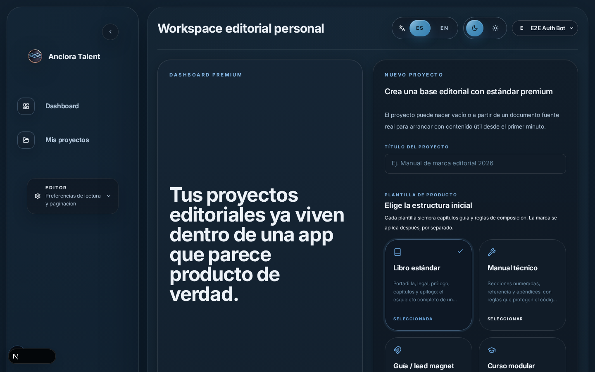

### Dashboard vacío

Si todavía no tienes proyectos, verás un estado inicial con una acción para crear el primero. Un estado vacío no significa que la cuenta esté rota: significa que aún no se ha creado un proyecto.

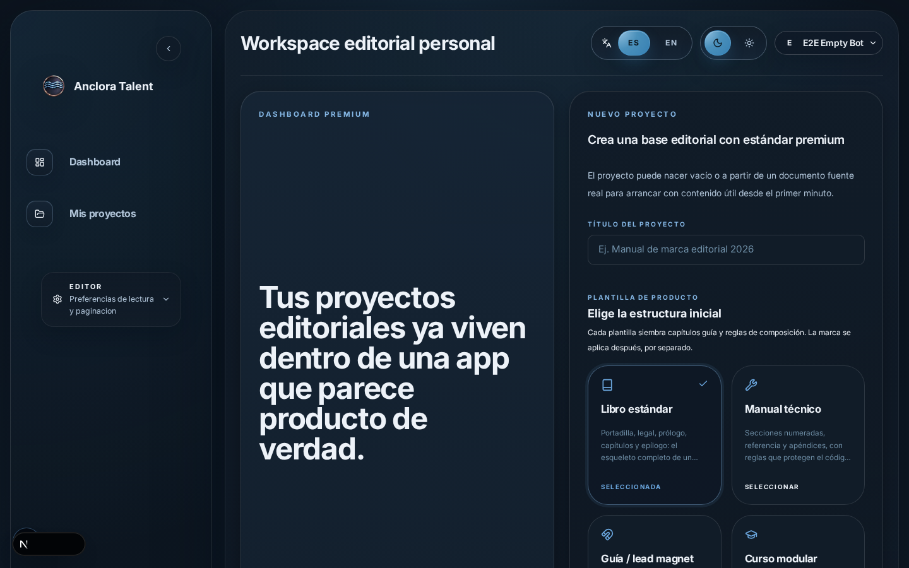

1. Pulsa **Crear nuevo proyecto** o **Crear el primer proyecto**.
2. Sigue el formulario de proyecto.
3. Al terminar, entrarás en el editor del proyecto.

### Mis proyectos

La pantalla **Mis proyectos** es la vista completa del inventario. Úsala cuando tengas varios proyectos o cuando no recuerdes el título exacto.

- Busca por título.
- Revisa el recuento de resultados.
- Abre el proyecto que necesitas.
- Utiliza la paginación cuando la lista sea larga.
- Comprueba fecha de actualización y número de capítulos antes de entrar.

El acceso rápido de la cabecera y **Mis proyectos** comparten la misma identidad de proyecto. El acceso rápido sirve para saltar pronto a un proyecto; la pantalla completa sirve para buscar y revisar el inventario.

### Proyectos con títulos parecidos

Si dos proyectos tienen títulos iguales o casi iguales, no elijas solo por el nombre. Comprueba la fecha de actualización, el autor y el número de capítulos. Si vas a trabajar sobre uno de ellos, abre la ficha y confirma el título dentro del workspace.

### Abrir y volver

1. Abre un proyecto desde una tarjeta, una fila o el acceso rápido.
2. Trabaja dentro de su workspace.
3. Usa los enlaces del encabezado para volver al editor, preview o portada.
4. Para regresar al inventario, pulsa **Mis proyectos**.

El proyecto abierto no cambia porque cambies de pantalla. Los controles de una ruta concreta actúan sobre el proyecto que aparece en esa ruta.

## 4. Crear un proyecto

### Proyecto vacío

**Úsalo cuando:** vas a escribir el contenido en Talent o quieres preparar primero la estructura.

1. Entra en **Dashboard**.
2. Pulsa **Crear nuevo proyecto**.
3. Escribe el **Título del proyecto**.
4. Elige una plantilla, por ejemplo **Libro estándar**, **Manual técnico**, **Guía / lead magnet** o **Curso modular**, si están disponibles.
5. Decide si vas a subir un manuscrito ahora.
6. Pulsa **Crear proyecto y abrir editor**.

La plantilla inicial puede sembrar capítulos guía y reglas de composición. Después puedes ajustar la estructura desde el editor.

### Proyecto a partir de un manuscrito

En el mismo formulario puedes usar **Manuscrito (opcional)** para subir un archivo compatible. La aplicación analiza el documento antes de crear el proyecto definitivo.

Usa esta opción cuando ya tengas el texto y quieras empezar con una base editorial organizada. Conserva una copia del archivo original hasta revisar la importación.

### Qué revisar antes de crear

- El título debe identificar el proyecto.
- El archivo debe abrirse correctamente en tu equipo.
- El tamaño debe respetar el límite que muestra la pantalla.
- La plantilla debe parecerse al tipo de publicación que estás preparando.
- Si el documento contiene información sensible, comprueba que estás en la cuenta correcta.

## 5. Workspace editorial

El workspace concentra el trabajo principal. La parte superior muestra el proyecto y el recorrido actual. El panel lateral reúne progreso y navegación; el área central contiene la edición o la revisión seleccionada.

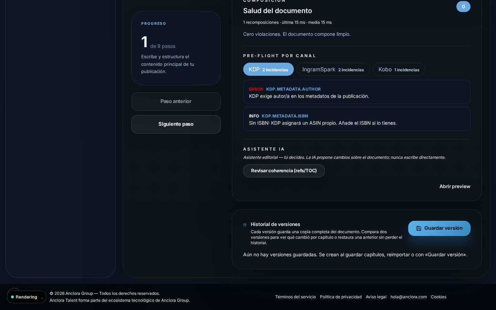

### Cómo leer la pantalla

- **Progreso:** indica el paso del recorrido editorial.
- **Documento:** contiene metadatos, capítulos y contenido.
- **Composición:** muestra reglas y avisos que pueden afectar a la publicación.
- **Preview:** abre una lectura paginada del resultado.
- **Historial de versiones:** permite guardar una copia completa para comparar o recuperar trabajo.
- **Portada y contraportada:** abren sus estudios de diseño.

La interfaz conserva controles avanzados, pero no necesitas abrirlos todos para empezar a escribir. Si estás creando el primer proyecto, completa primero el contenido y deja las reglas avanzadas para una segunda revisión.

### Recorrido recomendado

1. Comprueba el título y los datos principales.
2. Importa o escribe el contenido.
3. Revisa capítulos y orden.
4. Corrige avisos del documento.
5. Ajusta composición si el resultado lo necesita.
6. Diseña portada y contraportada.
7. Abre preview.
8. Exporta y revisa el archivo descargado.

## 6. Importar y preparar el manuscrito

### Formatos de entrada

La pantalla de importación muestra los formatos aceptados por la instalación. El flujo actual contempla documentos de texto y Word; también puede mostrar tratamiento de PDF escaneado mediante OCR cuando esa capacidad está disponible. Si un archivo no es compatible, la pantalla lo indica.

No cambies la extensión de un archivo para forzar la importación. Exporta o guarda una copia en un formato aceptado.

### Pasos de importación

1. Abre **Crear nuevo proyecto** o el área **Manuscrito** del proyecto.
2. Pulsa **Arrastra tu documento aquí** o selecciona el archivo.
3. Espera a que aparezca **Analizando documento...**.
4. Revisa **Listo para importar**.
5. Comprueba título, autor, número de capítulos y tipo de manuscrito detectados.
6. Revisa la **Estructura detectada**.
7. Lee los avisos de **Revisión recomendada**.
8. Confirma la importación solo cuando la estructura tenga sentido.

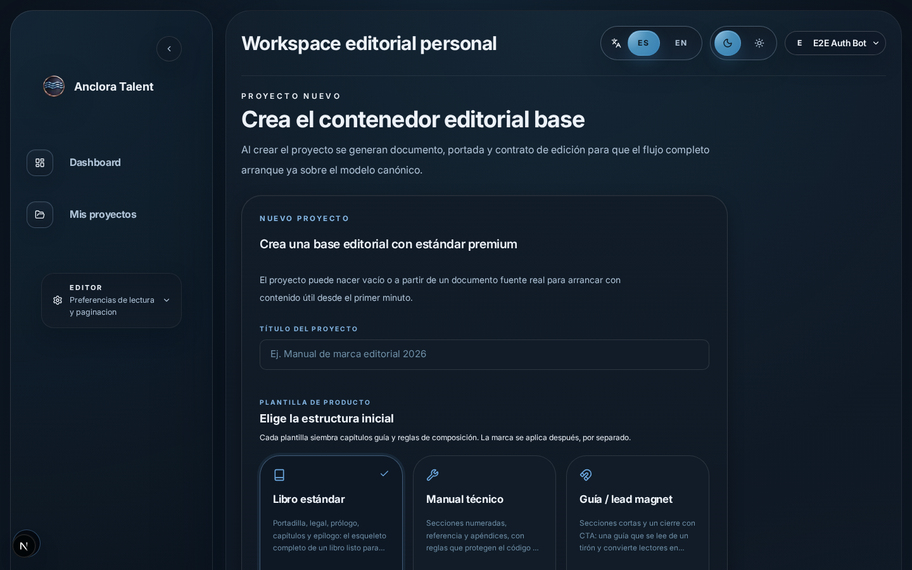

### Qué significa la confianza

Cuando aparece una confianza alta, media o baja, es una señal para revisar cuánto trabajo de comprobación conviene hacer:

- **Alta:** la aplicación encontró señales claras de estructura.
- **Media:** revisa especialmente títulos y cortes de capítulo.
- **Baja:** compara con el archivo original antes de continuar.

La importación ayuda a preparar el documento, pero no sustituye tu revisión editorial.

### Si la importación detecta mal un capítulo

1. No borres el archivo original.
2. Cancela o vuelve a seleccionar el archivo si todavía estás en el análisis.
3. Si el proyecto ya fue creado, corrige el título o el orden desde el organizador de capítulos.
4. Revisa también el índice y la preview.
5. Guarda una versión cuando el resultado sea coherente.

## 7. Capítulos, edición y formato

### Añadir y ordenar capítulos

El organizador de capítulos permite trabajar con una estructura explícita. Cada capítulo conserva una posición y un identificador propio.

- Pulsa **Añadir capítulo** para crear uno.
- Usa **Editar capítulo** para cambiar título o contenido.
- Usa **Mover capítulo arriba** y **Mover capítulo abajo** para ajustar el orden.
- Usa **Eliminar capítulo** solo después de comprobar que no contiene texto que necesites.
- Utiliza **Capítulo anterior** y **Siguiente capítulo** para recorrer el manuscrito.

El orden de los capítulos se refleja en preview y exportación. Después de mover o borrar un capítulo, revisa el índice y la numeración.

### Escribir y editar

Dentro del editor puedes colocar el cursor, escribir texto y seleccionar fragmentos. La barra de formato permite, según el contexto:

- negrita, cursiva y tachado;
- alineación izquierda, centrada, derecha y justificada;
- listas con viñetas y numeradas;
- color de texto y resaltado;
- imágenes;
- saltos de página;
- deshacer y rehacer.

Usa estilos con intención. Un título debe marcar una sección; no lo uses solo para aumentar el tamaño de un párrafo.

### Imágenes y enlaces

Inserta una imagen solo cuando tengas derecho a utilizarla y cuando aporte valor al manuscrito. Comprueba su posición en preview y en el archivo exportado.

Los enlaces deben apuntar al destino correcto. Después de exportar HTML o PDF, comprueba que el enlace sigue siendo identificable y que el texto que lo acompaña explica su destino.

### Atajos

El editor ofrece atajos para acciones frecuentes, como deshacer, rehacer, avanzar o retroceder entre capítulos y guardar. Si no recuerdas un atajo, utiliza el control visible: el resultado debe ser el mismo.

## 8. Composición, metadatos y guardado

### Datos del proyecto

Antes de exportar, revisa:

- título;
- subtítulo, si existe;
- autor;
- idioma del documento;
- ISBN u otros datos editoriales, si aplican;
- reglas y preferencias de composición.

Estos datos pueden aparecer en portada, contraportada, índice, preview y exportación.

### Preferencias de composición

Las preferencias de edición permiten elegir una vista de dispositivo, tamaño de texto, familia tipográfica y márgenes. Estas preferencias ayudan a revisar el resultado y pueden alimentar la configuración de exportación.

Cambiar el dispositivo de vista no cambia el contenido del manuscrito. Cambia la forma en que se calcula y se presenta la composición.

### Avisos de composición

El workspace puede mostrar **Salud del documento**, **Cero violaciones** o incidencias por canal. Lee el mensaje concreto antes de exportar.

Si la exportación está bloqueada, corrige primero las violaciones indicadas. Si solo hay avisos, decide si son aceptables para tu destino y revísalos en preview.

### Guardar trabajo y versiones

Guarda los cambios cuando termines una unidad editorial. El estado **Guardado** confirma que la operación terminó; **Guardando** indica que todavía está en curso.

El panel **Historial de versiones** permite usar **Guardar versión**. Una versión es una copia de referencia del documento, útil antes de una reestructuración importante o antes de reimportar.

No cierres la pestaña mientras aparezca **Guardando**. Si una acción falla, conserva el texto original y vuelve a cargar solo después de comprobar qué se guardó.

## 9. Portada y contraportada

### Cover Studio

Abre **Cover studio** desde el workspace o desde preview. La pantalla permite trabajar con una plantilla y ajustar el contenido guiado. En el modo avanzado puedes editar capas de texto directamente sobre el lienzo.

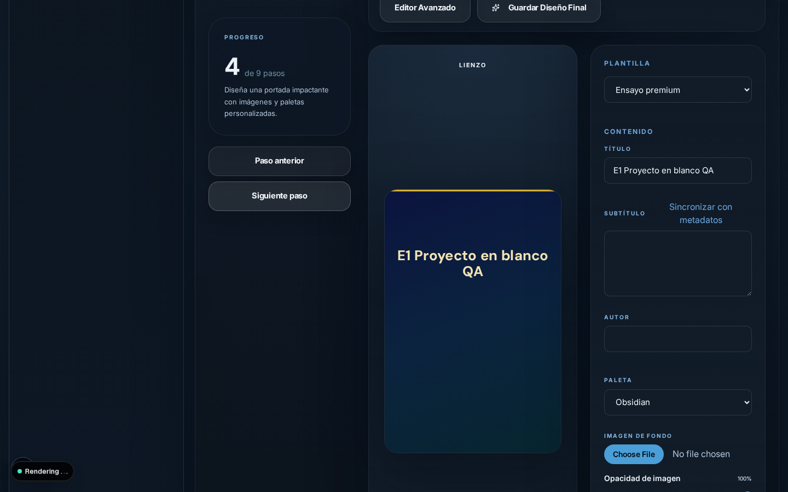

Puedes ajustar, según la plantilla:

- título;
- subtítulo;
- autor;
- paleta;
- imagen de fondo y opacidad;
- alineación;
- negrita y cursiva;
- tamaño, interlineado y espaciado;
- visibilidad de elementos.

Pulsa **Guardar portada** o **Guardar Diseño Final** cuando el resultado sea correcto. La portada guardada debe coincidir con la que revisas en preview.

### Imagen de portada

Usa una imagen que tengas derecho a publicar. Si aparece **Generar imagen**, úsalo para guardar la representación preparada por la aplicación. Revisa el resultado en la preview y en el archivo final.

### Contraportada

Abre **Contraportada** desde el estudio de portada o desde el workspace. Puedes completar:

- título del autor;
- texto de contraportada;
- biografía del autor.

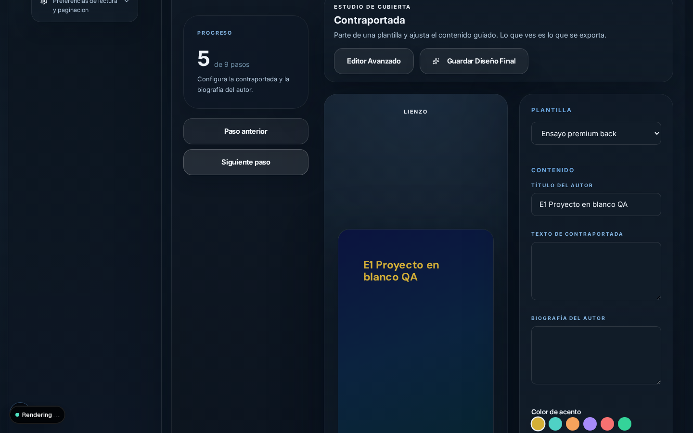

Escribe un texto breve y revisa que no se corte en la vista final. Pulsa **Guardar contraportada** y vuelve a preview antes de exportar.

## 10. Preview y revisión final

### Preview del proyecto

La preview es una lectura visual del proyecto. No es un sustituto del archivo final: sirve para revisar composición, orden, portada, contraportada y paginación antes de descargar.

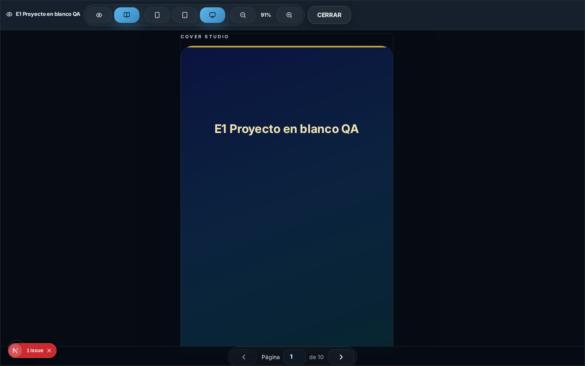

En la barra superior puedes encontrar controles para:

- vista de una página o dos páginas;
- laptop, tablet o móvil;
- zoom;
- página anterior y siguiente;
- índice de la preview;
- cerrar.

### Revisión completa

1. Comprueba la portada.
2. Avanza varias páginas del manuscrito.
3. Revisa títulos y saltos de capítulo.
4. Comprueba listas, citas, imágenes y enlaces.
5. Revisa la contraportada.
6. Cambia temporalmente de dispositivo si vas a publicar en más de un formato.
7. Vuelve al editor si encuentras un problema.

Si aparece **Sin contenido para mostrar**, no exportes todavía. Comprueba que el proyecto contiene capítulos y que la lectura no está bloqueada por un error de carga.

### Preview y archivo descargado

La preview muestra cómo se compone el documento dentro de la aplicación. El archivo descargado puede tener reglas adicionales propias de su formato. Por eso la revisión termina después de abrir el archivo exportado.

## 11. Exportar

### Antes de descargar

Completa esta lista:

- El manuscrito tiene contenido.
- Los capítulos están en el orden correcto.
- Los metadatos principales son correctos.
- La portada y la contraportada están guardadas.
- La preview muestra texto real.
- No hay violaciones bloqueantes.
- Has elegido el formato que necesitas.

Los botones de exportación aparecen en la zona de preview y pueden mostrar **Exportar HTML**, **Exportar PDF** y **Exportar Word (.docx)**.

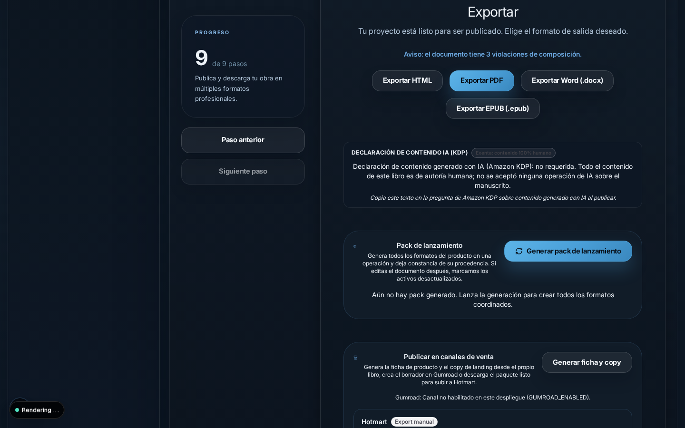

### HTML

**Úsalo para:** conservar una versión web del proyecto o revisar el contenido en un navegador.

1. Abre preview.
2. Pulsa **Exportar HTML**.
3. Guarda el archivo descargado.
4. Ábrelo en un navegador.
5. Comprueba título, headings, párrafos, capítulos, imágenes y enlaces.

El archivo HTML debe contener el manuscrito, no solo una portada o una pantalla vacía.

### Word

**Úsalo para:** continuar la edición en un procesador de textos.

1. Abre preview.
2. Pulsa **Exportar Word (.docx)**.
3. Abre el archivo en Word, LibreOffice o una aplicación compatible.
4. Comprueba que puedes seleccionar y editar el texto.
5. Revisa el orden de capítulos, encabezados, listas e imágenes.

Si el documento se ve como una sola imagen, no lo consideres correcto para continuar editándolo: vuelve a generar el archivo y comprueba el estado del proyecto.

### PDF

**Úsalo para:** compartir o revisar una versión paginada.

1. Abre preview.
2. Pulsa **Exportar PDF**.
3. Espera a que termine la preparación.
4. Abre el PDF descargado.
5. Comprueba que el texto se puede seleccionar, que se lee y que las páginas coinciden con la preview.

La fidelidad visual y la semántica son comprobaciones diferentes. Un PDF que descarga correctamente puede seguir necesitando revisión de contenido.

### EPUB y otros paquetes

El repositorio contiene un flujo EPUB y capacidades de pack de lanzamiento. Si tu workspace muestra **Exportar EPUB (.epub)** o **Pack de lanzamiento**, sigue las instrucciones de esa pantalla y revisa el archivo con un lector compatible. No confundas una capacidad disponible en una ruta técnica con un botón que necesariamente aparezca en todos los proyectos.

### Qué hacer si el archivo está vacío

No continúes con un archivo que no contenga el manuscrito. Vuelve al editor, comprueba que los capítulos tienen texto, guarda los cambios y repite preview y exportación. Si vuelve a ocurrir, conserva el archivo descargado y anota formato, proyecto y hora para soporte.

## 12. Trabajar en móvil y tablet

Anclora Talent adapta el espacio de trabajo a pantallas estrechas. El editor físico no debe convertirse en una doble página de escritorio recortada.

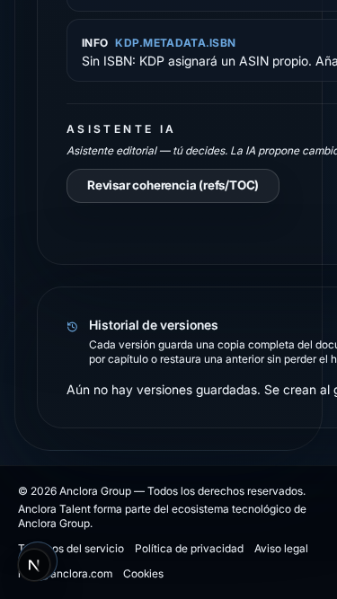

En móvil:

- el documento se presenta en una columna ajustada;
- las herramientas pueden ocupar varias filas;
- la navegación entre capítulos permanece accesible;
- los controles secundarios pueden quedar detrás de un menú;
- el contenido principal debe aparecer antes que los paneles avanzados.

En tablet, la aplicación puede mostrar más controles en paralelo, pero el orden del contenido sigue siendo el mismo.

### Recomendaciones

1. Gira el dispositivo si necesitas una revisión amplia de una portada.
2. Usa la vista móvil para comprobar lectura y clipping.
3. Usa escritorio para ajustes finos de composición y Cover Studio.
4. Si un control no aparece, abre el menú de navegación o reduce el zoom del navegador sin forzar un desplazamiento horizontal.

## 13. Idioma, tema y preferencias

### Cambiar idioma

En la cabecera, pulsa el selector que muestra **ES** o **EN**.

- **ES** muestra la interfaz en español.
- **EN** muestra la interfaz en inglés.

El cambio se guarda en la preferencia del navegador y se aplica también a las pantallas cargadas por el servidor. Si una pantalla conserva el idioma anterior, actualiza la página una vez y comprueba que la cookie de preferencia no está bloqueada.

El idioma de la interfaz no cambia automáticamente el idioma editorial del manuscrito. El idioma del documento es un dato separado que debes revisar en sus metadatos.

### Cambiar tema

La aplicación empieza en tema **dark**. Pulsa el control de luna o sol para cambiar entre tema oscuro y claro. El tema es una preferencia de interfaz; no cambia colores ni contenido ya guardados en una portada o en un documento.

### Preferencias de editor

En el panel de preferencias puedes ajustar familia tipográfica, tamaño, dispositivo y márgenes. Estas opciones sirven para trabajar y revisar el proyecto. Cambiar una preferencia no debe borrar capítulos ni alterar su orden.

## 14. Si algo no funciona

| Problema | Posible causa | Qué hacer |
| --- | --- | --- |
| No puedo entrar | Email, contraseña o sesión incorrectos | Revisa ambos campos y vuelve a intentarlo; utiliza recuperación si olvidaste la contraseña |
| No recibo recuperación | Mensaje en spam o servicio de correo no disponible | Revisa spam, confirma el email y contacta con soporte si el aviso indica indisponibilidad |
| No veo mi proyecto | Búsqueda, cuenta o proyecto equivocados | Comprueba la cuenta, limpia la búsqueda y revisa **Mis proyectos** |
| La preview aparece vacía | Proyecto sin capítulos o carga incompleta | Vuelve al editor, confirma que hay texto y recarga después de guardar |
| La importación falla | Archivo no compatible, grande o difícil de analizar | Usa un formato aceptado, revisa el límite y conserva el original |
| Un capítulo está en el sitio equivocado | Orden no revisado después de importar o mover | Usa **Mover capítulo arriba/abajo**, guarda y revisa preview |
| Cover Studio no carga | Imagen o datos del proyecto no disponibles | Vuelve al editor, confirma el proyecto y abre de nuevo el estudio |
| La exportación tarda | Documento largo, imágenes o preparación del formato | Espera a que termine; no cierres la pestaña mientras muestre estado de progreso |
| El archivo exportado no contiene el texto | Error de integridad del artefacto | No lo publiques; guarda el archivo, repite guardado/preview y registra el formato |
| El modal de proyectos no responde | Foco o carga incompleta | Pulsa Escape, vuelve a abrirlo y usa la tabla completa como alternativa |
| El idioma solo cambia en una parte | Cookie antigua o página sin refrescar | Cambia otra vez, actualiza la página y comprueba ES/EN en una pantalla distinta |
| Se cerró la sesión | Sesión caducada | Vuelve a iniciar sesión; el contenido persistido permanece en la cuenta |

Cuando informes de un problema, incluye ruta, idioma, tema, formato de pantalla, nombre sintético del proyecto y pasos realizados. No envíes contraseñas, tokens ni claves.

## 15. Preguntas frecuentes

### ¿Necesito una cuenta?

Sí, necesitas una cuenta para guardar y recuperar proyectos en el espacio autenticado.

### ¿Puedo empezar sin manuscrito?

Sí. Crea un proyecto vacío y empieza a escribir desde el editor.

### ¿Puedo importar un Word?

El flujo de proyecto contempla manuscritos Word compatibles. Revisa siempre la estructura detectada después del análisis.

### ¿Se guarda automáticamente?

Las operaciones de guardado muestran estados como **Guardando** y **Guardado**. Además puedes usar **Guardar versión** antes de cambios importantes.

### ¿Qué diferencia hay entre preview y export?

Preview es la lectura dentro de Talent. Export es el archivo que sale de la aplicación. Debes revisar ambos.

### ¿Puedo editar después de exportar?

Sí. El proyecto sigue siendo editable. Después de cambiarlo, vuelve a revisar y exporta otra versión.

### ¿Qué formato debo descargar?

HTML para navegador, Word para continuar editando y PDF para compartir o revisar paginación. Elige según el uso final y comprueba el archivo.

### ¿Puedo usar Talent desde el móvil?

Sí, para revisar y editar en una pantalla estrecha. Para composición avanzada y diseño de portada, una pantalla grande ofrece más espacio.

### ¿Qué ocurre si cierro el navegador?

Los cambios que ya aparecen como guardados permanecen en tu proyecto. Si cerraste mientras decía **Guardando**, vuelve a entrar y comprueba el contenido antes de seguir.

### ¿Cómo recupero mi contraseña?

Usa **¿Olvidaste tu contraseña?** en la pantalla de acceso y sigue el enlace válido recibido.

## 16. Glosario

| Término | Significado |
| --- | --- |
| Proyecto | Espacio que reúne título, manuscrito, capítulos, metadatos y superficies de publicación |
| Manuscrito | Texto de trabajo que vas a editar y preparar |
| Capítulo | Unidad ordenada del manuscrito |
| Workspace | Espacio de trabajo editorial del proyecto |
| Composición | Reglas que determinan cómo se distribuye el contenido en páginas |
| Preview | Vista de lectura del resultado dentro de Talent |
| Cover Studio | Herramienta para diseñar la portada |
| Contraportada | Superficie posterior con resumen, título del autor o biografía |
| Exportación | Generación de un archivo descargable |
| Versión | Copia guardada del documento para comparar o recuperar trabajo |
| Violación | Aviso de una regla de composición que requiere revisión |
| Proyecto vacío | Proyecto sin manuscrito inicial, listo para empezar a escribir |
